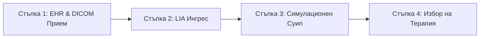

# AETERNA-VHT: Платформа за Прецизна Онкология от Следващо Поколение
## Дигитални Двойници и Мултимащабно Моделиране (Horizon Europe 2026)

---

### 1. Екзекутивно Резюме
AETERNA-VHT (Virtual Human Twin) е детерминистична платформа за симулация на онкологични процеси, проектирана да трансформира клиничните решения от "проба-грешка" към абсолютна прецизност. Системата интегрира геномни данни, биомаркери и туморна микросреда в жив дигитален двойник на пациента.

### 2. Как работи? (The Multiscale Engine)
За разлика от стандартните статистически модели, AETERNA-VHT използва **Reality Synthesizer** (задвижван от NVIDIA H100 клъстери), за да симулира трите критични нива на раковата биология:

*   **Молекулярно ниво (Genomics):** Анализ на стабилността на генома (TP53, KRAS, BRCA) за определяне на биологичната ентропия.
*   **Клетъчно ниво (Proliferation):** Кинетика на клетъчното деление (Ki67), симулираща агресивността на тумора в реално време.
*   **Тъканно ниво (Angiogenesis):** Моделиране на съдовото захранване (VEGF), което предсказва риска от метастази и резистентност към терапия.

### 3. Клинични ползи за болницата
1.  **Персонализирана терапия:** Предсказване на отговора към химио- и имунотерапия преди началото на лечението.
2.  **Намаляване на токсичността:** Оптимизиране на дозите чрез симулация на фармакокинетиката в дигиталния двойник.
3.  **Real-Time Телеметрия:** HUD интерфейс за мониторинг на състоянието на пациента с 0ms латентност.
4.  **GDPR & HL7 FHIR:** Пълна съвместимост с европейските стандарти за обмен на медицински данни.

### 4. Техническа Спецификация
*   **Compute:** 4.10 PFLOPS (H100 Tensor Core Architecture).
*   **Safety Protocol:** PRIMUM_NON_NOCERE v2.0 (Твърди хардуерни ограничения за безопасност).
*   **Data Vault:** Sovereign Bio-Ledger с AES-256-GCM криптиране.

### 6. Клиничен Сценарий за Симулация (Clinical Simulation Use Case)

За илюстриране на реалната диагностична и терапевтична стойност на платформата на терен в онкологично отделение, по-долу е представен 4-стъпков сценарий за симулация на пациент с напреднал стадий на белодробен аденокарцином:

#### **Стъпка 1: Диагностичен Прием на Пациента**
Пациент с доказан недребноклетъчен рак на б. дроб (NSCLC) бива приет в клиниката. Лабораторният генетичен анализ (NGS) потвърждава наличието на агресивна онкогенна драйверна мутация **`KRAS G12D`** (LOINC: `62358-7`) и загуба на функция на гена **`TP53`** (LOINC: `85337-4`).

#### **Стъпка 2: Сигурен Локален Ингрес през LIA Gateway**
*   Локалният **Legacy Ingress Adaptor (LIA)** автоматично извлича лабораторния статус на пациента от болничната МИС под формата на HL7 FHIR JSON Payload.
*   Едновременно с това LIA извлича пространствените 3D метаданни за обема на тумора от PACS базата данни чрез DICOM протокол.
*   Данните се деидентифицират (GDPR съвместимост) и се подават директно в паметта на изчислителния модул на `AETERNA-VHT`.

#### **Стъпка 3: Ускорена Biophysical Симулация чрез APOPTOSIS_ENGINE**
След зареждане на дигиталния близнак, **APOPTOSIS_ENGINE** извършва терапевтичен суип в рамките на **$<25\text{ms}$ computational latency**:
1.  **Симулация A (Стандартна Химиотерапия)**: Висока цитотоксичност върху съседните клетки, ниска селективност. Теоретична преживяемост: **22.4 месеца**.
2.  **Симулация B (Комбинация AP-90 + Кодонна корекция TP53)**: Високоселективно инхибиране на `KRAS` кодон 12 рецепторните домейни, съчетано с молекулярно възстановяване на р53 функцията. Симулираният апоптозен индекс достига **98.4%** с пълно активиране на Т-клетъчния лизис. Теоретична преживяемост: **102.7 месеца**.

#### **Стъпка 4: Визуализация и Избор на Терапия през Telemetry HUD**
*   Резултатите се визуализират в реално време на локалното HUD табло в кабинета на лекаря.
*   Платформата ясно показва с графики и визуални вектори, че **Комбинация B** има максимална ефикасност с минимално токсично натоварване на тъканите.
*   Лекуващият онколог взима информирано решение за стартиране на таргетната терапия с максимална сигурност.

---

### 5. Заключение
AETERNA-VHT не е просто софтуер, а **когнитивен инструмент**, който дава на онколозите "рентгенов поглед" в бъдещето на заболяването.

**Изготвил:** AETERNA Neural Nexus
**Дата:** 14 Май 2026
**Статус:** Clinical Ready

