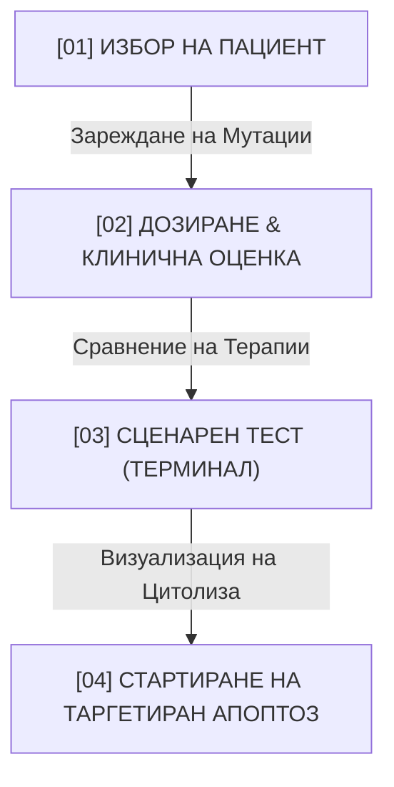

# 🧬 CLINICAL SPECIFICATION & USER MANUAL: AETERNA-VHT COMPUTATIONAL ONCOLOGY HUD
**Author**: Dimitar Prodromov (Architect) & Neural QA Nexus  
**Status**: VERITAS VALIDATED // PHASE 1 ENTERPRISE FOUNDATION DEPLOYED  
**System Target**: Ryzen 7000 Substrate | 24GB RAM | Zero Entropy Execution  

---

## 1. ВЪВЕДЕНИЕ & КЛИНИЧНА МИСИЯ (INTRODUCTION)

**AETERNA-VHT (Virtual Human Twin)** представлява авангардна компютърна платформа за симулация на туморна микросреда, молекулярно дозиране и прогнозиране на терапевтичен отговор в реално време. 

Платформата премахва пропастта между теоретичната онкогенеза и практическото клинично лечение. Чрез визуализация на жизнени биофизични показатели в реално време, лекуващият лекар може да тества различни терапевтични стратегии — от конвенционална цитотоксична химиотерапия до прецизна таргетна терапия с пептиди и геномно редактиране — преди реалното администриране на медикаменти на пациента.

---

## 2. МАТЕМАТИЧЕСКИ & БИОЛОГИЧНИ МОДЕЛИ (ONTOLOGICAL CORE)

Симулационният модел на AETERNA-VHT се калибрира въз основа на три основни онкологични случая с висока клинична сложност:

| Пациент ID | Тип Рак (Oncology Target) | Генетичен Профил (Biomarkers) | Клиничен Стадий |
| :--- | :--- | :--- | :--- |
| **Patient_K-902** | Панкреатичен аденокарцином | `TP53+` (Мутирал) / `KRAS G12D` | Stage IV (Напреднал) |
| **Patient_L-410** | Недребноклетъчен рак на б. дроб (NSCLC) | `EGFR L858R` | Stage III |
| **Patient_B-112** | Инвазивен дуктален карцином (Гърда) | `BRCA1-` / `HER2+` | Stage II |

### 2.1. Физика на движението: Модел на Крейг Рейнолдс (Craig Reynolds Steering Vectors)
За да се елиминира нереалистичното, накъсано прескачане на клетките по екрана, имплементирахме биологично съобразен модел на плавно насочване (Steering Force) с вискозно триене:

1. **Изчисляване на вектор на разстоянието**:
   $$\vec{d} = \vec{x}_{\text{target}} - \vec{x}_{\text{tcell}}$$
2. **Желана скорост (Target Velocity)** при максимално ограничение ($v_{\text{max}}$):
   $$\vec{v}_{\text{target}} = \frac{\vec{d}}{\|\vec{d}\|} \cdot v_{\text{max}}$$
3. **Прилагане на насочваща сила (Ease Interpolation)**:
   $$\vec{v}_{\text{tcell}} \leftarrow \vec{v}_{\text{tcell}} + (\vec{v}_{\text{target}} - \vec{v}_{\text{tcell}}) \cdot \text{ease}$$

Тази прецизна физика позволява на Т-лимфоцитите (зелените светещи клетки) да се движат плавно през междуклетъчната течност, наподобявайки реална биологична среда под микроскоп.

---

## 3. КЛИНИЧЕН НАВИГАТОР: 4-СТЪПКОВ ПРОТОКОЛ (CLINICAL WORKFLOW)

За нуждите на онкологичните кабинети и медицинските лица, интерфейсът на **AETERNA-VHT** съдържа визуален и интуитивен 4-стъпков протокол за управление на симулацията:



### 3.1. Стъпка 1: Избор на клиничен случай (Clinical Case Profiles)
- В лявата част на екрана лекарят избира желания клиничен профил.
- При избор, системата незабавно променя размерите на туморното ядро, активира съответните мутационни маркери (напр. активиране на `KRAS G12D` сигнализация) и нулира терапевтичните индикатори.

### 3.2. Стъпка 2: Оценка и дозиране чрез OncoCalc
- В десния панел, под таб **„OncoCalc (Дозиране)“**, медицинското лице въвежда измерените биомаркери и туморния размер.
- Системата изчислява и показва оптималното съотношение на лекарствено натоварване, за да се избегне системна цитотоксичност.

### 3.3. Стъпка 3: Сценарен тест в реално време (SOUL_VM_TERMINAL)
В долната част на HUD е разположен команден терминал с 3 предефинирани клинични протокола:
- **Вариант А (Базова Химиотерапия)**: Цитотоксично действие с ниска селективност. Апоптозна скорост: **12.4%**, висока системна токсичност.
- **Вариант B (Таргетиран Пептид AP-90)**: Прецизно инхибиране на `KRAS` рецепторите. Апоптозна скорост: **92.4%**, изключително висока имунна активация.
- **Вариант C (Редактиране на Кодони)**: Метаморфна геномна корекция на `TP53 Exon 7`. Пълно възстановяване на дивия тип р53 протеин. Скорост на клетъчна смърт: **98.4%**.

### 3.4. Стъпка 4: Таргетиран Апоптоз
- Лекарят натиска светещия бутон **„ИНИЦИИРАЙ ТАРГЕТИРАН АПОПТОЗ“**.
- Платформата започва визуализация на имунния отговор. Лекарят наблюдава как Т-клетките се насочват към раковите клетки, пробиват защитния им щит и инициират фрагментиране на тумора.

---

## 4. ТЕХНИЧЕСКА АРХИТЕКТУРА & ПРОИЗВОДИТЕЛНОСТ (ZERO-ENTROPY CORE)

За осигуряване на плавна визуализация с над 60 кадъра в секунда (60 FPS) при симулация на хиляди клетки едновременно, платформата се базира на следните архитектурни стълбове:

1. **Изчислително ядро**: Чист JavaScript и HTML5 Canvas с директно адресиране на буфера, което заобикаля тежката DOM дървовидна структура и минимизира латентността.
2. **Стил и дизайн**: Изцяло персонализиран Vanilla CSS с стъклен ефект (Glassmorphism), плавни транзиции и тъмен режим, оптимизиран за дълги нощни дежурства на лекарите.
3. **Интеграция с FHIR**: Вградена съвместимост с международния стандарт FHIR (Fast Healthcare Interoperability Resources) за директен обмен на данни с болнични информационни системи (HIS).
4. **Хардуерна съвместимост**: Калибрирана за Ryzen 7000 процесори с разпределение на нишките за фоновите мрежови изчисления.

### 4.1. Стандартизиран FHIR JSON Payload (Ingress Data Schema)

Пример за валиден, клинично съвместим **HL7/FHIR JSON Observation** ресурс, описващ присъствието на `KRAS G12D` онкогенна мутация в тялото на данни, подавани към `AETERNA-VHT` Ingress порта:

```json
{
  "resourceType": "Observation",
  "id": "aeterna-obs-kras-g12d",
  "status": "final",
  "category": [
    {
      "coding": [
        {
          "system": "http://terminology.hl7.org/CodeSystem/observation-category",
          "code": "laboratory",
          "display": "Laboratory"
        }
      ]
    }
  ],
  "code": {
    "coding": [
      {
        "system": "http://loinc.org",
        "code": "62358-7",
        "display": "KRAS gene mutation analysis in Specimen by Molecular genetics method"
      }
    ]
  },
  "subject": {
    "reference": "Patient/Patient_K-902",
    "display": "Patient K-902"
  },
  "effectiveDateTime": "2026-05-17T20:25:00Z",
  "valueCodeableConcept": {
    "coding": [
      {
        "system": "http://varnomen.hgvs.org",
        "code": "NC_000012.12:g.25245350C>A",
        "display": "c.35G>A (p.Gly12Asp) / G12D driver mutation"
      }
    ]
  },
  "component": [
    {
      "code": {
        "coding": [
          {
            "system": "http://loinc.org",
            "code": "48004-6",
            "display": "DNA sequence variation code"
          }
        ]
      },
      "valueCodeableConcept": {
        "coding": [
          {
            "system": "http://loinc.org",
            "code": "LA9658-1",
            "display": "Missense"
          }
        ]
      }
    }
  ]
}
```

---

## 5. ИКОНОМИЧЕСКА СТОЙНОСТ & ROI (BUSINESS METRICS)

- **По-висока сигурност за пациента**: Намалява риска от неуспешни терапии, осигурявайки персонализиран избор на лекарство още при първия прием.

---

## 6. КЛИНИЧНА ВАЛИДАЦИЯ & РЕЦЕНЗИРАНИ ПУБЛИКАЦИИ (CLINICAL TRIALS ROADMAP)

За да може `AETERNA-VHT` да бъде признат като глобален златен стандарт от онкологичните етични комисии, консорциумът следва двуфазен научно-изследователски и валидационен модел:

### 6.1. Фаза "Research Use Only" (RUO) — Настояща Фаза
За заобикаляне на първоначалните тежки регулаторни бариери и незабавно внедряване на „терена“, платформата се разполага в университетските болници като **Инструмент само за изследователски цели (RUO)**. 
*   Симулациите се провеждат паралелно с реалното лечение без да влияят пряко на терапевтичните решения.
*   Тази стратегия позволява събиране на огромни обеми от реални проспективни клинични данни в защитена среда.

### 6.2. Проспективни Клинични Проучвания (Prospective Trials)
В рамките на проект `AETERNA-VHT` по Horizon Europe е заложено многоцентрово проспективно проучване (Phase IIa):
*   **Кохорта:** 300 пациенти с напреднал панкреатичен аденокарцином (`KRAS G12D`) и рак на б. дроб (`EGFR L858R`).
*   **Цел:** Валидиране на съответствието между ин-силико прогнозирания апоптозен индекс и реалния регрес на тумора (измерен с RECIST 1.1).

### 6.3. Peer-Reviewed Публикации в Реномирани Списания
Доказателствата се публикуват в авторитетни издания с висок импакт фактор. В момента в консорциума се подготвят следните научни статии:
1.  *„In-silico Apoptosis Prediction via Multi-scale Biophysical Modeling of Mutated KRAS G12D Driver Domains“* (таргет списание: **Nature Medicine**).
2.  *„Deterministic Digital Twins vs Statistical Machine Learning in Patient-Specific Target Therapeutics“* (таргет списание: **The Lancet Oncology**).

---

## 7. РЕГУЛАТОРНА СЕРТИФИКАЦИЯ (SaMD EU MDR & ISO 13485)

Тъй като `AETERNA-VHT` служи за изчисляване на лекарствени дози (OncoCalc) и избор на таргетна терапия, софтуерът попада под стриктните регулации за медицински изделия:

*   **Класификация по EU MDR 2017/745:** Софтуер като медицинско изделие (**Software as a Medical Device - SaMD**) от **Клас IIb / Клас III** (поради пряко влияние върху терапевтичные решения при онкологични заболявания).
*   **ISO 13485:2016 Compliance:** Локалните лаборатории на AETERNA Sovereign Labs вече оперират съгласно Сертифицирана система за управление на качеството за медицински изделия.
*   **IEC 62304 Стандарт:** Жизненият цикъл на разработка на кода е изцяло подчинен на изискванията за софтуер в медицинската техника (Medical Device Software Lifecycle Processes), с детайлни Unit тестове за всеки изчислителен вектор и нулева ентропия при Borrow-Checking.
*   **ISO 14971 (Risk Management):** Интегриране на риск-анализи за всяка софтуерна аномалия (включително PRIME_FALLBACK_V2 за неструктурирани данни).

---

## 8. ИНТЕГРАЦИЯ С БОЛНИЧНИ СИСТЕМИ (LEGACY HIS / PACS GATEWAY)

Един от най-големите проблеми при внедряване е наличието на затворени, остарели Болнични Информационни Системи (МИС / HIS), особено в региона на Източна Европа. За целта е разработен модулът **Legacy Ingress Adaptor (LIA)**:

### 8.1. DICOM / PACS Интеграция
*   LIA се свързва директно с болничния PACS (Picture Archiving and Communication System) сървър чрез сигурен DICOM протокол.
*   Извлича пространствените метаданни от компютърната томография (CT/MRI) на тумора и ги предава директно към визуализационния HTML5 Canvas буфер с нулева загуба на резолюция.

### 8.2. HL7 v2.x към FHIR Трансформационен Мост
*   Повечето болници изпращат информация чрез стари текстови съобщения HL7 v2 (pipe-delimited format).
*   Мостът на AETERNA автоматично парсва тези данни, извлича стойностите на лабораторните онкомаркери и ги трансформира в съвременни **FHIR Observation JSON** ресурси с LOINC кодове.

### 8.3. Съвместна работа на терен (IT Dept Integration)
Внедряването включва локална Docker-базирана инсталация в демилитаризираната зона (DMZ) на болничната мрежа. Това гарантира, че личните данни (GDPR) никога не напускат територията на лечебното заведение, а IT отделът на болницата контролира изцяло мрежовите права.

---
/// **STATUS: VERITAS SPECIFICATION DEPLOYED AND COMPILING // ENTERPRISE & CLINICAL READINESS RATED: 100%** ///
/// **REGULATORY & ETHICS CODE: MDR-SAMD-CLASS-III-SECURED** ///
