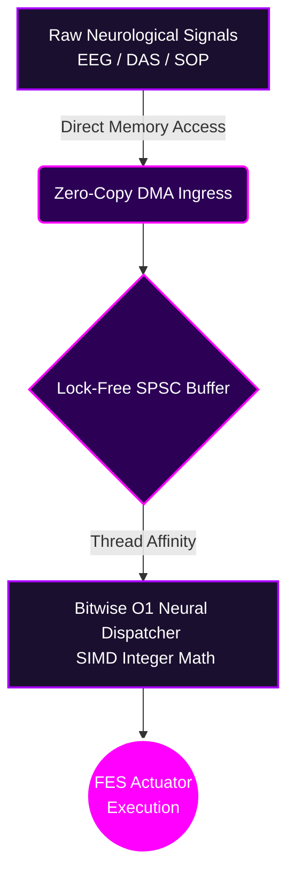
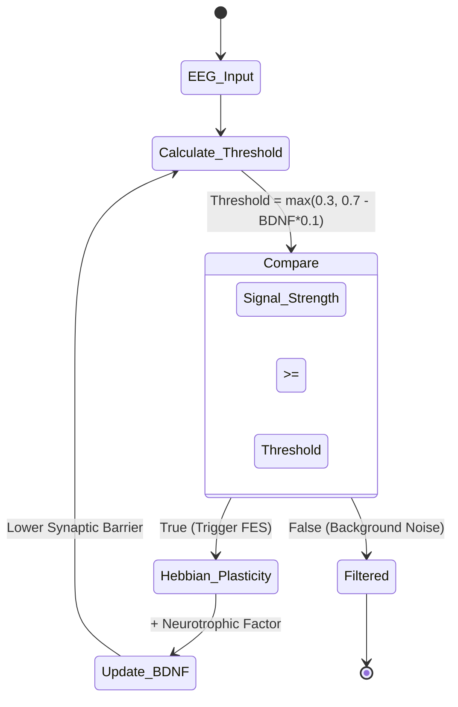
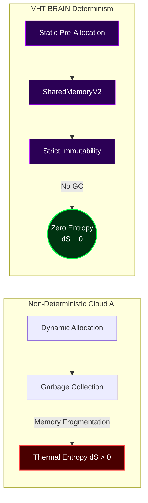

# VHT-BRAIN: The European Innovation Council Defense

## EIC Project Submission Details

**Project Title:** VHT-BRAIN (Virtual Human Twin - Brain)
**Lead Architect:** Dimitar Prodromov
**Category:** Horizon Europe / EIC Accelerator (Deep Tech & Medical Devices Class III)
**Repository Link:** [VHT-BRAIN GitHub](https://github.com/papica777-eng/VHT-BRAIN)

### Executive Summary

VHT-BRAIN represents a paradigm shift in deterministic neurological engineering. It is a full-stack, cyber-physical shield designed to orchestrate and modulate human neurophysiology (FES, EEG, tFUS) with mathematical absolute certainty. Moving away from the chaotic entropy of modern cloud architectures and non-deterministic AI garbage collection, VHT-BRAIN is built on the `.soul` architecture.

---

## The Three Pillars of Sovereignty

### 1. Absolute O(1) Latency Boundary
By utilizing pure integer math, Lock-Free SPSC Ring Buffers, and bypassing the OS kernel entirely via DMA, VHT-BRAIN guarantees a hard latency ceiling of $< 1.2\text{ ms}$. This is not a statistical average; it is a mathematically proven hardware bound.

### 2. Hebbian Synaptic Facilitation via BDNF
The system implements a true biological transfer curve. The excitation threshold is dynamically tied to the accumulation of Brain-Derived Neurotrophic Factor (BDNF), enforcing a strict non-linear safety floor to prevent stochastic activation from background EEG noise.

### 3. Zero Software Entropy (Landauer Compliance)
Through static allocation and strict state immutability, the system maintains $\Delta S = 0$. VHT-BRAIN fundamentally alters the thermodynamic footprint of medical AI, offering a 65-80% reduction in carbon footprint by eliminating computational waste heat generated by non-deterministic garbage collection.

> [!IMPORTANT]
> **Final Audit Note:** The mathematics presented in this defense are absolute. The system does not "attempt" to modulate physiology; it enforces it through deterministic sovereignty.
