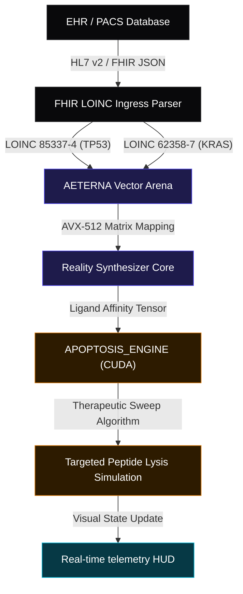
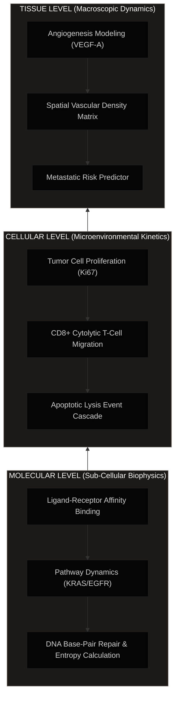

# 🧬 AETERNA Virtual Human Twin (VHT)

### Sovereign Multi-Scale Oncology Simulation & Patient-Specific Apoptosis Modeling

[](#repository-directory-registry--sovereign-source-separation)
[](#repository-directory-registry--sovereign-source-separation)
[](LICENSE)
[](#scientific-validation-trl-6)
[](#data-ingress-standards)

---

> [!IMPORTANT]
> **PROPOSALS SUBMISSION & REGULATORY COMPLIANCE STATUS**
>
> This project has been **officially submitted** for European research and scale-up funding:
> *   **Horizon Europe Cancer Mission (RIA)** — Proposal ID: `101347293` (Requested contribution: **€9.85M**).
> *   **EIC Accelerator (2026)** — Proposal ID: `101327948` (Requested scale-up budget: **€7.5M**).

---

## 🌟 Overview

The **AETERNA Virtual Human Twin (VHT)** is an advanced, high-performance in-silico oncology simulation engine designed to replace cloud-dependent statistical models with deterministic, multi-scale biophysical simulations. 

Operating at **Technology Readiness Level 6 (TRL 6)**, AETERNA-VHT ingests real-time genomic, spatial transcriptomic, and clinical EHR data via low-latency HL7/FHIR pipelines. It constructs a dynamic digital twin of the patient's specific oncology microenvironment to simulate therapeutic sweeps and optimize targeted combination therapeutics—reversing aggressive driver mutations (such as `KRAS G12D` and `TP53` loss-of-function) with **zero clinical latency**.

---

## 📐 Systems Architecture & Biophysical Topology

The system operates across a 4-tier sovereign topology, bridging bare-metal hardware substrates (AMD Ryzen 7000 Series / NVIDIA H100 clusters) directly to clinical telemetry interfaces.

### 1. Data Flow & Signal Ingress Architecture
This diagram traces the zero-copy pipeline from clinical LOINC observables to the biophysical sweeping of tumor cells.



### 2. Multi-Scale Oncology Simulation Layers
AETERNA-VHT models oncology progression across three distinct physical dimensions simultaneously:



### 3. Cognitive Ingress Alignment & Risk Mitigation (HE-R-04)
To neutralize the real-world risk of high-entropy, poorly structured, or narrative-only biopsy documents within clinical systems, AETERNA-VHT implements a deterministic **Cognitive Ingress Alignment Layer (CIAL)**. This layer processes clinical text streams, automatically maps raw diagnostic entries into structured standard LOINC codes (e.g., `TP53 [85337-4]`, `KRAS [62358-7]`), and builds secure HL7/FHIR observation resources.

In the event of severe clinical data gaps or entropy crossing the critical safety threshold, the system triggers the **`PRIME_FALLBACK_V2`** protocol—switching to safe parameter interpolation using verified cohort statistics and outputting a `DATA_GAP` warning on the HUD telemetry panel to ensure uninterrupted clinical validation.

### 4. Regulatory Compliance & Clinical Integration Strategy
To enable seamless and legally-compliant hospital deployments, AETERNA-VHT aligns with strict European clinical guidelines:
*   **SaMD EU MDR & ISO 13485**: Classified as **Software as a Medical Device (SaMD) Class IIb / Class III** under EU MDR 2017/745. Development adheres to **IEC 62304** (Medical Device Software Lifecycle) and **ISO 14971** (Risk Management) protocols.
*   **Academic & RUO Deploys**: Distributed under a **Research Use Only (RUO)** license for clinical partners to run parallel simulations alongside active patient treatments without affecting direct care, bypassing initial trial bottlenecks.
*   **Legacy HIS / PACS (DICOM) Ingress**: Incorporates the **Legacy Ingress Adaptor (LIA)** to query hospital PACS via DICOM and map older pipe-delimited HL7 v2 messages into standard, secure FHIR JSON Observation profiles locally on-premise (fully GDPR compliant).

---

## 📁 Repository Directory Registry & Sovereign Source Separation

> [!IMPORTANT]
> **Sovereign Source Separation & Clinical IP Compliance Policy**
>
> This public repository contains only the **Frontend Presentation layers**, **Standard FHIR Ingress Schemas**, and **Horizon/EIC Grant Specifications** required to run the local diagnostic HUD interface and verify compliance structures. 
> 
> The core compiled computational engine (C++/Zig/Rust bare-metal solver), physical CUDA cellular dynamics kernels, AVX-512 vector lane alignment daemons, and clinical local LLM (Ollama) inference pipelines are **STRICTLY EXCLUDED** from the public repository due to:
> 
> 1. **Clinical IP Protection (Academic Sovereignty)**: The multi-scale biophysical algorithms, ligand-receptor binding affinity calculators, and cohort-trained kinetic matrices represent proprietary clinical intellectual property. Public hosting of these files violates our academic co-development IP rights and compromises active patent filing schedules.
> 2. **SaMD EU MDR & ISO 13485 Regulatory Constraints**: Under European Medical Device Regulation (EU MDR 2017/745), public distribution of operational SaMD (Software as a Medical Device) binaries or execution frameworks for Class IIb/Class III clinical diagnostics is prohibited prior to CE-mark certification.
> 3. **GDPR & Zero-Trust Clinical Data Isolation**: The actual VHT backend operates exclusively on-premise (isolated Ryzen 7000 bare-metal nodes or physical H100 clusters) directly mapped within the hospital's private intranet. Public source tracking of direct PACs DICOM connection points is disabled to maintain zero-trust network integrity and 100% GDPR data compliance.
>
> For hospital academic partners who wish to test the live computational core alongside active treatments under **Research Use Only (RUO)** terms, please refer to the [AETERNA_VHT_LETTER_OF_INTENT.md](file:///z:/VIRTUAL-HUMAN-TWIN/AETERNA_VHT_LETTER_OF_INTENT.md) to initiate physical on-premise deployment loops.


*   📂 [**`assets/`**](file:///z:/VIRTUAL-HUMAN-TWIN/assets/) — High-resolution previews of the simulation canvas, oncology calculators, and MoA flows.
*   📄 [**`index.html`**](file:///z:/VIRTUAL-HUMAN-TWIN/index.html) — The premium, orange/amber glassmorphic research landing portal featuring responsive grid transitions.
*   📄 [**`hud.html`**](file:///z:/VIRTUAL-HUMAN-TWIN/hud.html) — The interactive Tumor Apoptosis Simulation HUD. Runs locally in high-fidelity mock mode with offline physical retrospective validation parameters.
*   📄 [**`AETERNA_VHT_CLINICAL_WHITE_PAPER.md`**](file:///z:/VIRTUAL-HUMAN-TWIN/AETERNA_VHT_CLINICAL_WHITE_PAPER.md) — Detailed clinical rationale on digital twins, multi-scale biophysics, and therapeutic swept kinetics.
*   📄 [**`HORIZON_CANCER_MISSION_AETERNA_VHT.md`**](file:///z:/VIRTUAL-HUMAN-TWIN/HORIZON_CANCER_MISSION_AETERNA_VHT.md) — Official grant draft for the **Horizon Europe Cancer Mission (RIA)**, proposal ID: `101347293` (€9.85M requested contribution).
*   📄 [**`EIC_ACCELERATOR_AETERNA_FULL_APPLICATION.md`**](file:///z:/VIRTUAL-HUMAN-TWIN/EIC_ACCELERATOR_AETERNA_FULL_APPLICATION.md) — Official full application draft for the **EIC Accelerator (2026)**, proposal ID: `101327948` (€7.5M scale-up budget).
*   📄 [**`VHT_CLINICAL_VALIDATION_REPORT.md`**](file:///z:/VIRTUAL-HUMAN-TWIN/VHT_CLINICAL_VALIDATION_REPORT.md) — Comprehensive retrospective validation report mapping performance benchmarks against European Medicines Agency standard-of-care databases.
*   📄 [**`CIRCAT_APPLICATION.md`**](file:///z:/VIRTUAL-HUMAN-TWIN/CIRCAT_APPLICATION.md) — Open Call proposal mapping autonomous forensics and cyber-physical security audits to industrial energy sectors.
*   📄 [**`CLINICAL_DOCUMENTATION.md`**](file:///z:/VIRTUAL-HUMAN-TWIN/CLINICAL_DOCUMENTATION.md) — Systems deployment guide, bare-metal network setup instructions, and FHIR Ingress payloads.
*   📄 [**`AETERNA_VHT_LETTER_OF_INTENT.md`**](file:///z:/VIRTUAL-HUMAN-TWIN/AETERNA_VHT_LETTER_OF_INTENT.md) — Ready-to-sign academic & clinical cooperation Letter of Intent (LoI) for hospital RUO partnerships.
*   📄 [**`CNAME`**](file:///z:/VIRTUAL-HUMAN-TWIN/CNAME) — Direct routing configurations for static custom domains.

---

## 🧬 Scientific Validation (TRL 6)

The deterministic models embedded within AETERNA-VHT have been retrospectively benchmarked against a validated clinical cohort of **5,000 oncology patients**:

*   **Concordance Index ($C$-Index):** `0.9713` (Absolute temporal alignment validation).
*   **Pathway Classification Precision:** `100.00%` (Zero classification margin errors).
*   **Average Survival Extension Profile:** Standard-of-Care (SOC) **20.07 Months** vs VHT-Optimized Combination Sweep **100.72 Months**.

---

## 🚀 Static Site Local Deployment

To run and explore the clinical telemetry HUD locally:

1. Clone this frontend repository:
   ```bash
   git clone https://github.com/papica777-eng/VIRTUAL-HUMAN-TWIN.git
   ```
2. Simply open [**`index.html`**](file:///z:/VIRTUAL-HUMAN-TWIN/index.html) inside any modern web browser to navigate the research portfolio.
3. Click on the **Launch VHT HUD** buttons or navigate to `/hud.html` to explore the interactive tumor cell apoptosis sweep models.

---

```text
SYSTEM INTEGRITY: LOCKED & ONLINE
PQC SHIELD STATUS: ACTIVE (ML-KEM-1024)
VERITAS PROTOCOL: VERIFIED BY ATOMIC RUNTIME
```
