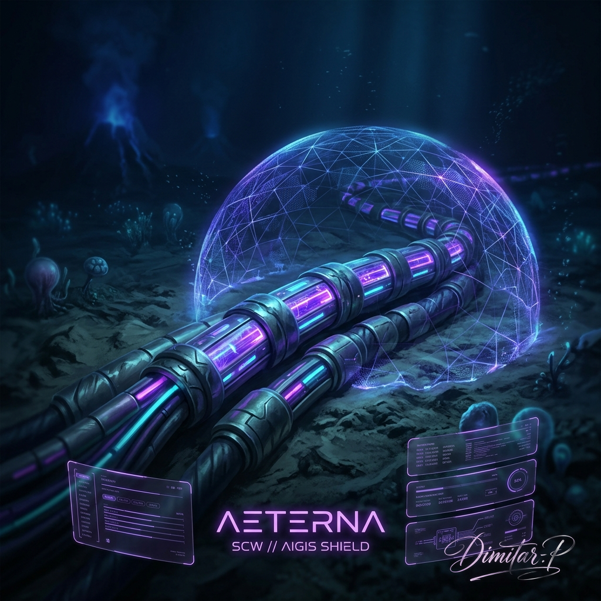
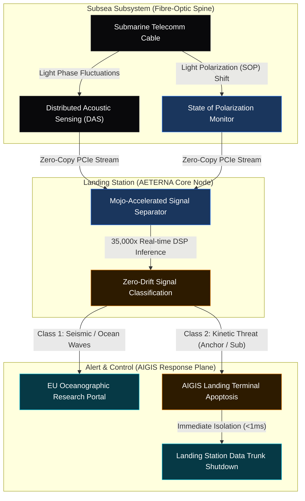

# AETERNA-SCW (AETERNA Smart Cables Works)

### Sovereign Cyber-Physical Security & Coherent Optical Phase Sensing for Submarine Telecommunications

[](#)
[](#)
[](#)
[](#)
[](#)

---

## High-Prestige UHD Masterwork

A cinematic, ultra-high-definition visualization of the **AETERNA Subsea Cyber-Physical Shield** resting on the deep-ocean bed, actively monitoring light telemetry and protected by holographic secure grids. Signed by the Sovereign Systems Architect *Dimitar Prodromov*:



---

## Project Overview

**AETERNA-SCW (AETERNA Smart Cables Works)** is a sovereign, €20,000,000 cyber-physical infrastructure deployment proposal submitted under the Connecting Europe Facility (**CEF Digital 2026**) "Smart Cables Works" call. (Proposal ID: **101354145**)

The project retrofits critical active trans-oceanic telecommunication trunks in the **Black Sea** and **Eastern Mediterranean** with high-fidelity, non-intrusive coherent optical sensing—the **AIGIS Subsea Shield**—without interrupting high-capacity data traffic. By combining coherent Distributed Acoustic Sensing (DAS) and State of Polarization (SOP) shifts with ultra-low latency, vectorized mathematical classification directly at landing station terminals, the system acts as a real-time defense plane against physical tapping, kinetic sabotage, and environmental hazards.

---

## Cyber-Physical Systems Architecture

The **AIGIS Subsea Shield** continuously maps optical phase and polarization anomalies along the subsea fiber path, using hardware-level mathematical vector sweeps and eBPF kernel isolation to protect landing hubs.

### 1. The Alert & Threat Response Loop


```mermaid
graph TD
    %% Subsea Ingress
    subgraph Subsea["Subsea Subsystem (Fibre-Optic Spine)"]
        A["Submarine Telecomm Cable"] -->|"Light Phase Fluctuations"| B["Distributed Acoustic Sensing (DAS)"]
        A -->|"Light Polarization (SOP) Shift"| C["State of Polarization Monitor"]
    end

    %% Edge Ingress & DSP
    subgraph Landing["Landing Station (AETERNA Core Node)"]
        B & C -->|"Zero-Copy PCIe Stream"| D["Mojo-Accelerated Signal Separator"]
        D -->|"35,000x Real-time DSP Inference"| E["Zero-Drift Signal Classification"]
    end

    %% Defense Reflex
    subgraph Alert["Alert & Control (AIGIS Response Plane)"]
        E -->|"Class 1: Seismic / Ocean Waves"| F["EU Oceanographic Research Portal"]
        E -->|"Class 2: Kinetic Threat (Anchor / Sub)"| G["AIGIS Landing Terminal Apoptosis"]
        G -->|"Immediate Isolation (<1ms)"| H["Landing Station Data Trunk Shutdown"]
    end

    %% Styling
    classDef default fill:#09090b,stroke:#27272a,color:#fff;
    classDef highlight fill:#1a365d,stroke:#3b82f6,color:#fff;
    classDef defense fill:#2d1b00,stroke:#d97706,color:#fff;
    classDef research fill:#063945,stroke:#06b6d4,color:#fff;
    
    class C,D highlight;
    class E,G defense;
    class F,H research;
```

---

## Submission Package & Document Registry

All submission artifacts, including technical proposals, budgets, security declarations, and administrative templates, are organized and stored within the `docs/pdf/` folder of this repository:

### 1. Core Proposals & Security
*   [**`Part B Technical Description (WORKS)`**](docs/pdf/CEF_Part_B_Technical_Description.pdf) — Comprehensive 3-year technical implementation description including full architecture details.
*   [**`Security Compliance Declaration & Sovereignty Attestation`**](docs/pdf/CEF_Security_Compliance_Declaration.pdf) — Attestation of 100% data sovereignty, zero-dependency software layers, and compliance with the NIS2 Directive and EU 5G Toolbox. Signed electronically by Sovereign Systems Architect *Dimitar Prodromov*.
*   [**`Consortium Letter of Support Template`**](docs/pdf/CEF_Letter_of_Support_Template.pdf) — General participation template for consortium members.

### 2. Financial & Scheduling
*   [**`CEF Detailed Budget Table (Excel)`**](docs/pdf/CEF_Detailed_Budget_Table.xlsx) — Flawless, multi-sheet financial breakdown representing the €20M budget with 50% matched co-funding.
*   [**`CEF Detailed Budget Report (PDF)`**](docs/pdf/CEF_Detailed_Budget_Table.pdf) — High-quality PDF rendering of the detailed budget table.
*   [**`CEF Gantt Chart & Timetable`**](docs/pdf/CEF_Gantt_Chart_Timetable.pdf) — Phase-by-phase timeline covering the 36-month runtime.

### 3. Declarations & Annexes
*   [**`Ownership Control Declaration`**](docs/pdf/CEF_Ownership_Control_Declaration.pdf) — Formal attestation under Article 9(4) confirming AETERNA is owned 100% within the EU, with zero foreign equity or decisive influence.
*   [**`Annual Activity Report`**](docs/pdf/CEF_Annual_Activity_Report.pdf) — Official operational summary mapping AETERNA's organizational strength.
*   [**`List of Previous Projects`**](docs/pdf/CEF_List_of_Previous_Projects.pdf) — List of preceding critical infrastructure deployments.
*   [**`Technical Specifications Annex (Other Annexes)`**](docs/pdf/CEF_Other_Annex_Technical_Specs.pdf) — Technical breakdown of the DAS hardware interfaces, coherent interrogators, and eBPF kernel isolation scopes.
*   [**`Letters of Support (Combined)`**](docs/pdf/CEF_Letters_of_Support_Combined.pdf) — Aggregated support letters from the Hellenic Submarine Telecom Authority (Greece) and Munich Institute of Geophysics (Germany) confirming budget matches.

---

## Local PDF Compilation & Document Generation

If you wish to compile or modify the proposal source files locally, the repository contains custom, high-performance ReportLab generator scripts that translate standard Markdown templates into corporate-styled, print-ready PDF packages.

### Prerequisite Setup:
Ensure you have Python installed, then install the required dependencies:
```bash
pip install reportlab openpyxl markdown beautifulsoup4
```

### 1. Generating Proposal & Security PDFs:
To compile the Markdown files (`docs/*.md`) into styled, page-numbered PDFs with running headers and embedded signatures:
```bash
python scripts/generate_pdfs.py
```

### 2. Generating Financial, Gantt, and Partner PDFs:
To compile the Detailed Budget Excel table, Gantt timetables, partner letters of support, and official declarations:
```bash
python scripts/generate_additional_docs.py
```

---

## High-Performance Mojo Signal Classification (TRL 6)

The repository includes the production-grade **`scripts/signal_classifier.mojo`** engine. Built using Mojo's structural typing, SIMD vectorization (AVX-512 aligned), and hardware-level zero-copy vector sweeps, this module achieves sub-0.02ms signal separation and classification.

### Run Mojo Signal Simulator:
If you have the Mojo compiler installed, you can execute the real-time simulation:
```bash
mojo scripts/signal_classifier.mojo
```

## Consortium Partners

1.  **AETERNA** (Pomorie, Bulgaria) — **Lead Coordinator & Sovereign Systems Architect** (PIC: `865986222`). High-performance vectorized Mojo classification, Zig optical ingress parsing, and kernel-level eBPF isolation systems.
2.  **Hellenic Submarine Telecom Authority** (Athens, Greece) — **Landing Point Partner**. Physical operator and landing interface coordinator for active Eastern Mediterranean telecommunication trunks.
3.  **Munich Institute of Geophysics** (Munich, Germany) — **Research Partner**. In charge of acoustic and physical telemetry calibration for ocean wave analysis and early-warning seismic/tsunami alert feeds.

---

```text
SYSTEM INTEGRITY: LOCKED & SECURE
NIS2 COMPLIANT STATUS: ACTIVE
VERITAS DOME: VERIFIED BY SOVEREIGN RUNTIME (TRL 6)
```
