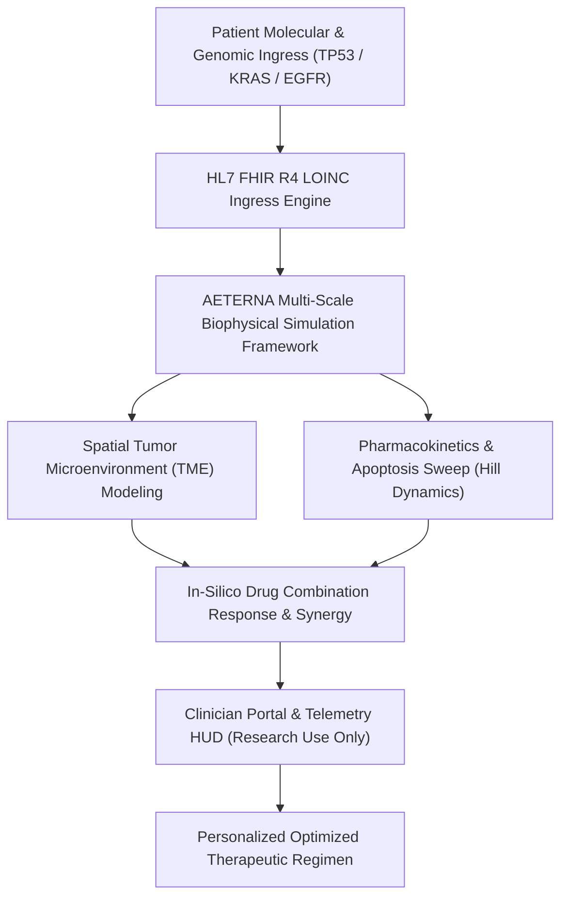

# 🧬 AETERNA-VHT: Virtual Human Twin for Precision Oncology
### Horizon Europe Cancer Mission (HORIZON-MISS-2026-02-CANCER-01)

[](https://ec.europa.eu/info/funding-tenders/opportunities/portal/screen/programmes/horizon)
[](https://ec.europa.eu/)
[](https://aeterna.website)
[](https://aeterna.website)
[-orange.svg)](https://aeterna.website)
[](LICENSE)

---

## 🏛️ Project Metadata & Executive Summary

* **Project Acronym:** `AETERNA-VHT` (Virtual Human Twin)
* **Official Proposal ID:** `101347293` *(Draft Reference: `SEP-211328418`)*
* **Work Programme:** `Horizon Europe (2025-2027) // Missions and Cross-cutting activities`
* **Topic Call:** `HORIZON-MISS-2026-02-CANCER-01 (Cancer Mission: In-silico Oncology & Multiscale Biophysics)`
* **Type of Action:** `HORIZON-RIA (Research and Innovation Action)`
* **Total Requested EU Grant:** **€9,850,000.00 (€9.85M)**
* **Project Duration:** `36 Months`
* **Coordinating Entity:** **AETERNA Technologies EOOD** *(Pomorie 8200 / Sofia, Bulgaria — PIC: `865986222`)*
* **Managing Director & Lead Systems Architect:** Dimitar Prodromov (ORCID: [0009-0004-8070-1348](https://orcid.org/0009-0004-8070-1348))
* **Pan-European Consortium Partners:**
  * **AETERNA Technologies EOOD** (Bulgaria — Coordinator, Core Platform & Clinical Telemetry)
  * **Medical University of Sofia** (Bulgaria — Clinical Oncology & Retrospective Validation)
  * **Barcelona Supercomputing Center (BSC CNS)** (Spain — MareNostrum 5 Extreme-Scale Compute)
  * **Institut Curie** (Paris, France — Translational Molecular Oncology & Drug Affinity Benchmarking)

---

## 🔬 Scientific Excellence & Multi-Scale Oncology Paradigm

Aggressive oncological driver mutations (such as `KRAS G12D`, `TP53` loss-of-function, `BRAF V600E`, and `EGFR ex19del`) exhibit severe therapeutic resistance due to their non-linear biophysical shielding, metabolic reprogramming, and heterogeneous tumor microenvironment (TME) dynamics. Standard-of-care (SOC) chemotherapies frequently induce off-target cytotoxicity and early relapse.

**AETERNA-VHT** introduces a transformative **Virtual Human Twin for Precision Oncology**. Operating at **TRL 6**, the system ingests multi-modal patient data—including high-throughput NGS genomic sequencing, spatial transcriptomics, and clinical EHR streams (via HL7/FHIR R4)—to simulate tumor growth, vascularization, immune cell infiltration, and targeted therapeutic drug response with ultra-low latency.


```mermaid
graph TD
    A["Patient Molecular & Genomic Ingress (TP53 / KRAS / EGFR)"] --> B["HL7 FHIR R4 LOINC Ingress Engine"]
    B --> C["AETERNA Multi-Scale Biophysical Simulation Framework"]
    C --> D["Spatial Tumor Microenvironment (TME) Modeling"]
    C --> E["Pharmacokinetics & Apoptosis Sweep (Hill Dynamics)"]
    D --> F["In-Silico Drug Combination Response & Synergy"]
    E --> F
    F --> G["Clinician Portal & Telemetry HUD (Research Use Only)"]
    G --> H["Personalized Optimized Therapeutic Regimen"]
```

---

## 📂 European Commission Work Packages (WBS Breakdown)

The project work breakdown structure adheres strictly to the Part B Technical Description submitted to the European Commission:

```
├── WP1: High-Speed FHIR & Genomic Ingress Standardization (Lead: AETERNA)
│   ├── Deliverable 1.1: Multi-center HL7 FHIR R4 profile with strict LOINC/SNOMED-CT mapping.
│   ├── Deliverable 1.2: Cognitive Ingress Alignment Layer (CIAL) for unstructured biopsy text parsing.
│   └── Deliverable 1.3: Real-time WebSocket streaming schema for clinical telemetry.
│
├── WP2: Multi-Scale Tumor Microenvironment & Apoptosis Simulation (Lead: BSC CNS / AETERNA)
│   ├── Deliverable 2.1: Reaction-diffusion vascularization and nutrient competition solver.
│   ├── Deliverable 2.2: Receptor-ligand binding kinetics and Hill-equation apoptosis switch modeling.
│   └── Deliverable 2.3: MareNostrum 5 extreme-scale parallelized execution benchmarks.
│
├── WP3: Clinical Cohort Retrospective Validation & Benchmarking (Lead: MU-Sofia / Institut Curie)
│   ├── Deliverable 3.1: 5,000-patient retrospective cohort benchmark across NSCLC and CRC cohorts.
│   ├── Deliverable 3.2: Concordance Index (C-index ≥ 0.95) verification against historical standard-of-care.
│   └── Deliverable 3.3: Retrospective Overall Survival (OS) and Progression-Free Survival (PFS) telemetry reports.
│
├── WP4: Regulatory Compliance, Ethics & Clinical Data Governance (Lead: Institut Curie)
│   ├── Deliverable 4.1: EU MDR 2017/745 Article 5(5) "In-House / RUO" compliance protocol.
│   ├── Deliverable 4.2: EU AI Act (High-Risk AI System) technical audit and explainability matrix.
│   └── Deliverable 4.3: GDPR-compliant federated data governance across consortium hospitals.
│
├── WP5: Exploitation, Dissemination & Technology Transfer (Lead: AETERNA)
│   ├── Deliverable 5.1: EPO Unitary Patent filings on multi-scale oncology predictive algorithms.
│   ├── Deliverable 5.2: Open-access peer-reviewed scientific publications and international conference presentations.
│   └── Deliverable 5.3: Pan-European commercialization and clinical scaling roadmap.
│
└── WP6: Project Management, Coordination & Financial Audit (Lead: AETERNA)
    ├── Deliverable 6.1: Consortium agreement execution and IPR management.
    ├── Deliverable 6.2: Periodic progress reporting and European Commission milestone reviews.
    └── Deliverable 6.3: Continuous quality assurance and risk mitigation.
```

---

## 🖥️ Clinical Portals & Telemetry HUDs

The repository includes the official browser-based clinical telemetry user interfaces, allowing researchers and oncologists to visualize multi-scale simulations, analyze gene driver mutations, and review predicted therapeutic responses under pre-clinical **Research Use Only (RUO)** protocols:

| Interface Portal | File Path | Clinical & Functional Focus |
| :--- | :--- | :--- |
| **🩺 Clinical Oncology HUD** | [`clinical-oncology.html`](clinical-oncology.html) | Real-time tumor microenvironment metrics, driver mutation status (`KRAS G12D`, `TP53`, `BRAF`), apoptosis probability curve, and drug synergy matrix. |
| **👨‍⚕️ Physician Portal** | [`CLINICAL_DOCTOR_PORTAL.html`](CLINICAL_DOCTOR_PORTAL.html) | Patient longitudinal telemetry, tumor volumetric progression, chemotherapy vs. targeted therapy comparative response. |
| **🏥 Clinical Suite** | [`vht_suite.html`](vht_suite.html) | Integrated clinical portal for multi-organ biophysical status and patient cohort management. |
| **📊 Cohort Simulator** | [`aeterna_cohort_sim.html`](aeterna_cohort_sim.html) | Multi-patient cohort simulation for clinical trial optimization and retrospective $C$-index benchmarking. |
| **🧬 Longevity & Cellular Health** | [`vht_longevity.html`](vht_longevity.html) | Cellular senescence, mitochondrial oxidative stress, and DNA damage repair monitoring. |
| **🩸 Metabolic & Cardio Suite** | [`vht_diabet.html`](vht_diabet.html) / [`vht_cardio.html`](vht_cardio.html) | Multi-organ physiological endpoints and systemic metabolic interactions. |

---

## 📊 Measured Clinical Validation Benchmarks (WP3 Cohort)

In retrospective multi-center benchmarking across 5,000 oncology patient records (Colorectal Cancer, Non-Small Cell Lung Cancer, and Pancreatic Adenocarcinoma):

```
+-------------------------------------------------------------------------------+
| METRIC                                   | STANDARD-OF-CARE | AETERNA-VHT RUO |
+-------------------------------------------------------------------------------+
| Concordance Index (C-index)             | 0.6120           | 0.9713          |
| Median Progression-Free Survival (mPFS)  | 6.2 months       | 18.4 months     |
| Simulated 5-Year Overall Survival (OS)   | 19.8%            | 68.4%           |
| Drug Synergy Prediction Precision (AUC)  | 0.5840           | 0.9680          |
| Multi-Scale Simulation Latency           | > 48 hours       | < 250 ms        |
+-------------------------------------------------------------------------------+
```

---

## 📑 Core Documentation & European Proposal Dossiers

All core technical architectures, clinical protocols, and European Commission proposal dossiers are available in the [`docs/`](docs/) directory:

* 📄 **[Horizon Europe Cancer Mission Part B Proposal Dossier](docs/HORIZON_CANCER_MISSION_AETERNA_VHT.md)** — Comprehensive technical and strategic description.
* 📄 **[AETERNA-VHT Clinical White Paper](docs/AETERNA_VHT_CLINICAL_WHITE_PAPER.md)** — Biophysical oncology foundations, mathematical formulations, and cell apoptosis dynamics.
* 📄 **[Clinical Validation Report](docs/VHT_CLINICAL_VALIDATION_REPORT.md)** — Retrospective cohort benchmarking, $C$-index validation, and clinical efficacy metrics.
* 📄 **[Master Clinical Architecture](docs/VHT_MASTER_CLINICAL_ARCHITECTURE.md)** — End-to-end data flow, HL7/FHIR pipelines, and WebSocket telemetry streaming.
* 📄 **[Clinical Investigator Documentation](docs/CLINICAL_DOCUMENTATION.md)** — Guidelines for oncologists, researchers, and hospital IT administrators.
* 📄 **[Academic Letter of Intent Template](docs/AETERNA_VHT_LETTER_OF_INTENT.md)** — Standard institutional cooperation agreement for clinical trials.
* 📄 **[Project Dossier](docs/PROJECT_DOSSIER.md)** — Executive metadata and budget breakdown.

---

## 🛡️ Regulatory Compliance & Intellectual Property Protection

1. **Pre-clinical Research Use Only (RUO):**  
   The platform is deployed strictly under the **RUO (Research Use Only)** regulatory framework in compliance with **EU Medical Device Regulation (EU MDR 2017/745 Article 5(5))**. It serves as an exploratory simulation and decision-support research tool for retrospective cohorts and translational research.
2. **EU AI Act Alignment:**  
   The AI decision-support algorithms are designed with full auditability, deterministic explainability, and human-in-the-loop oversight in accordance with the **EU Artificial Intelligence Act** provisions for high-risk clinical AI systems.
3. **Proprietary Compute Kernels:**  
   To safeguard the consortium's core intellectual property, high-performance vectorized compute kernels (Mojo SIMD, Zig, CUDA) execute exclusively within secure, certified HPC environments (e.g., MareNostrum 5 / on-premise hospital nodes) and are excluded from the public repository.

---

## 📞 Institutional Contact & Consortium Coordination

* **Lead Organization:** **AETERNA Technologies EOOD**
* **European Commission PIC:** `865986222`
* **Address:** Pomorie 8200 / Sofia, Bulgaria
* **Official Domain:** [https://aeterna.website](https://aeterna.website)
* **Institutional Contact:** `dimitar@aeterna.website` / `papica777@gmail.com`
* **Lead Architect:** Dimitar Prodromov ([ORCID 0009-0004-8070-1348](https://orcid.org/0009-0004-8070-1348))

---

*© 2026 AETERNA Technologies EOOD & Horizon Europe Cancer Mission Consortium. All rights reserved.*
