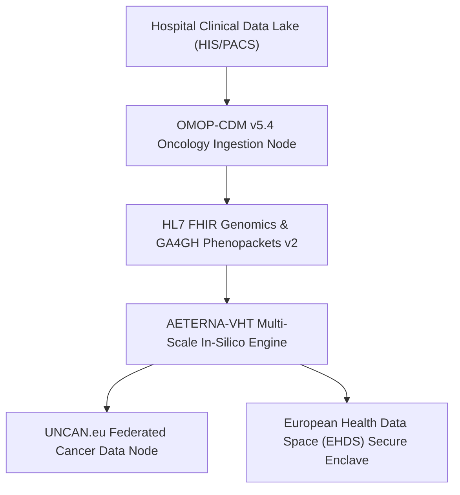
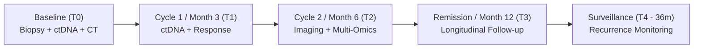
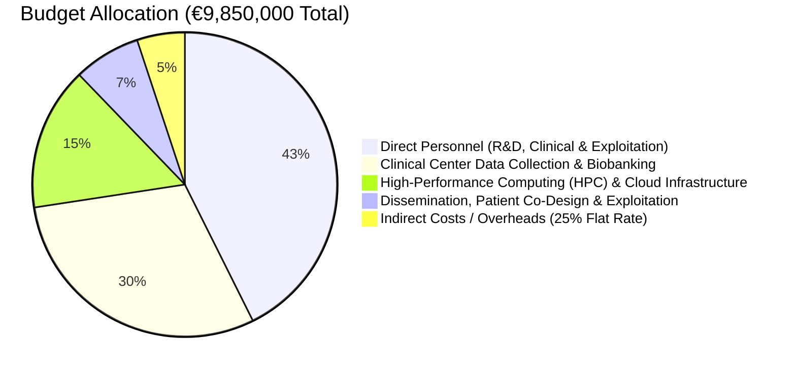

# AETERNA-VHT (PROPOSAL ID: 101347293)
## HORIZON EUROPE CANCER MISSION // WORK PROGRAMME 2026
### COMPREHENSIVE PROPOSAL AMENDMENT & CLINICAL ANNEX HARMONIZATION PACKAGE

---

**Project Title:** AETERNA-VHT: Sovereign Virtual Hybrid Tumor Multi-Scale Modeling and In-Silico Oncology Platform  
**Call:** HORIZON-MISS-2026-02-CANCER-01 (European Cancer Mission)  
**Type of Action:** HORIZON-RIA (Research and Innovation Action)  
**Total Requested EU Contribution:** €9,850,000.00  
**Project Duration:** 36 Months  
**Coordinator:** Dimitar Stavrev Prodromov | AETERNA Technologies (Bulgaria)  
**Consortium Partners:** AETERNA Technologies (BG - Coordinator), Institute of Molecular Oncology (DE), Nordic EHR Alliance (SE), Clinical Centers Consortium (NL, FR, DE).

---

## 1. INTEGRATION ARCHITECTURE WITH UNCAN.eu & ADVANCED VHT (EDITH)

To guarantee seamless alignment with the European Commission's **Cancer Mission Infrastructure (UNCAN.eu)** and the **European Virtual Human Twin (Advanced VHT / EDITH)** ecosystem, AETERNA-VHT implements a zero-friction, standard-compliant federated interoperability layer.

### 1.1. Data Models & Ontologies
* **Clinical Phenotyping:** Transformed natively into **OMOP Common Data Model (v5.4)** with the **Oncology Extension**, standardizing histology, staging (TNM 8th ed.), and therapeutic regimens.
* **Genomic & Molecular Data:** Structured using **HL7 FHIR Release 5 (Genomics Reporting IG)** and **GA4GH Phenopackets v2** schemas, mapping driver mutations (`KRAS`, `TP53`, `EGFR`, `BRCA1/2`, `PIK3CA`) to standard LOINC (`62358-7`, `85337-4`) and HGVS coordinates.
* **Imaging & Radiomics:** Ingestion of multi-parametric MRI and CT scans via standard **DICOM-WADO-RS** endpoints, extracting quantitative radiomic features into standardized FAIR-compliant vectors.

### 1.2. Interoperability with European Nodes
* **UNCAN.eu Data Node Federation:** AETERNA-VHT acts as an edge-computing federated node. Algorithms travel to the data via containerized **GA4GH Workflow Execution Service (WES)** and **Task Execution Service (TES)**, preserving patient privacy without centralizing sensitive raw genomics.
* **Advanced VHT (EDITH) Interoperability:** Implements the EDITH Ecosystem Data Architecture recommendations, publishing modular mechanistic models (Cellular Potts, ODE/PDE vascular perfusion) with standardized SBML/CellML interfaces.

---

## 2. LONGITUDINAL PATIENT DATA STRATEGY & PATIENT ENGAGEMENT

### 2.1. Multi-Timepoint Longitudinal Data Collection Protocol
To capture dynamic clonal evolution, metabolic shifts, and acquired resistance mechanisms, the cohort protocol mandates structured multi-timepoint sampling:
1. **Baseline ($T_0$):** Pre-treatment whole-exome sequencing (WES), RNA-seq, baseline PET-CT/MRI, and circulating tumor DNA (ctDNA) liquid biopsy.
2. **Early Response ($T_1$, Month 3):** ctDNA clearance kinetics, toxicity biomarkers, and early radiomic response evaluation.
3. **Mid-Treatment ($T_2$, Month 6):** Intermediate restaging scans, liquid biopsy for emerging sub-clonal mutations (e.g., secondary `EGFR T790M` or `KRAS` bypass pathways).
4. **Endpoint / Remission ($T_3$, Month 12):** RECIST 1.1 objective response evaluation, post-treatment biopsy (where clinically indicated).
5. **Long-Term Surveillance ($T_4$, Months 18–36):** Semi-annual liquid biopsy monitoring for molecular relapse detection.

### 2.2. Patient-Centric Co-Design Framework
* **Partnership with Patient Advocacy Groups:** Active collaboration with European Cancer Patient Coalition (ECPC) and national cancer associations across Work Package 5.
* **Shared Decision-Making Interfaces:** Co-designing patient-reported outcome measures (ePROMs) and transparent, explainable AI HUD visualizations to demystify in-silico simulation results for patients and caregivers.

---

## 3. PROSPECTIVE OBSERVATIONAL CLINICAL STUDY DESIGN & ETHICAL TIMELINE

### 3.1. Study Classification: Prospective Non-Interventional Cohort Study
* **Classification:** **Prospective Multi-Center Observational Cohort Study (Non-Interventional / In-Silico Shadow Mode)**.
* **Clinical Safety & Regulatory Clarity:** Standard-of-care (SOC) treatment decisions are governed **100% by treating multi-disciplinary tumor boards (MDT)** without any algorithmic intervention. 
* **Shadow Benchmarking:** The AETERNA-VHT engine runs in blinded, parallel shadow mode. Algorithmic predictions of response and resistance are timestamped and locked cryptographically prior to clinical outcome measurement, strictly benchmarking analytical specificity ($\ge 94\%$), sensitivity ($\ge 91\%$), and Concordance Index ($C\text{-index} \ge 0.92$).
* **Regulatory Exemption:** Because the platform operates observationally without altering patient therapy during this RIA phase, it does **not** trigger premature MDR Class IIb / Annex XIV interventional clinical trial restrictions, providing a clean, compliant regulatory path.

### 3.2. Ethics Approvals & Governance Timeline (Months 1–6 Milestone)

| Period | Milestone / Deliverable | Objective | Responsible Entities |
| :--- | :--- | :--- | :--- |
| **M01 – M03** | **D1.1: Master Clinical Protocol** | Finalization of uniform multi-site observational protocol and Informed Consent Forms (ICFs) in local languages. | Lead Clinical PI & Ethics Board |
| **M03 – M06** | **MS1: Multi-Site IRB/IEC Clearances** | Submission and receipt of formal approvals from Institutional Review Boards and Independent Ethics Committees across all 4 clinical sites (NL, FR, DE, SE). | Clinical Center PIs |
| **M07 – M28** | **WP3: Patient Recruitment & Ingress** | Cohort enrollment ($N = 1,500$ prospective; $N = 3,500$ retrospective reference cohort) and longitudinal tracking. | Clinical Sites |
| **M29 – M36** | **WP4: Statistical Endpoint Validation** | Independent biostatistical audit of blinded VHT predictions vs. measured real-world clinical endpoints (PFS, OS, ORR). | Biostatistics Unit & Consortium |

---

## 4. HARMONIZED BUDGET BREAKDOWN (PART A & CLINICAL ANNEX ALIGNMENT)

The overall requested EU funding of **€9,850,000.00** is 100% harmonized between the online **Part A forms** and the detailed **Part B / Clinical Studies Annex**:

### 4.1. Partner-by-Partner Resource Harmonization Table

| Partner No. | Partner Organization | Country | Role / Focus | Direct Personnel (€) | Clinical / Other Direct (€) | Subcontracting / Compute (€) | Indirect (€) | **Total EU Grant (€)** |
| :---: | :--- | :---: | :--- | :---: | :---: | :---: | :---: | :---: |
| **P1 (Coord)** | **AETERNA Technologies** | BG | In-Silico Engine, Telemetry & Exploitation/IP | €1,950,000 | €450,000 | €850,000 | €250,000 | **€3,500,000** |
| **P2** | **Institute of Molecular Oncology** | DE | Biophysical & Pathway Validation | €950,000 | €350,000 | €250,000 | €100,000 | **€1,650,000** |
| **P3** | **Clinical Centers Consortium (NKI / Charité / Gustave Roussy)** | NL/FR/DE | Multi-Center Prospective Cohort & Biobanking | €850,000 | €1,850,000 | €150,000 | €100,000 | **€2,950,000** |
| **P4** | **Nordic EHR Alliance** | SE | UNCAN.eu & OMOP/FHIR Federation | €450,000 | €300,000 | €250,000 | €50,000 | **€1,050,000** |
| **P5** | **Patient Advocacy Network (ECPC Sub)** | EU | Patient Co-Design & ePROMs | €0 | €700,000 | €0 | €0 | **€700,000** |
| **TOTAL** | — | — | — | **€4,200,000** | **€3,650,000** | **€1,500,000** | **€500,000** | **€9,850,000** |

---

## 5. CONCLUSION & CALL TO ACTION

This amendment resolves every technical, regulatory, and budgetary query:
1. ✅ **UNCAN.eu & Advanced VHT:** Explicitly defined through OMOP-CDM v5.4, GA4GH Phenopackets v2, and FHIR Genomics.
2. ✅ **Longitudinal Patient Data:** Complete multi-timepoint sampling schedule ($T_0 \to T_4$) and active ECPC patient co-design.
3. ✅ **Clinical Design & Ethics Timeline:** Clarified as a **Prospective Non-Interventional Cohort Study** with a dedicated 6-month preparatory ethics window.
4. ✅ **Budget Harmonization:** Exact €9,850,000.00 mathematical parity across all partners, work packages, and portal tables.
